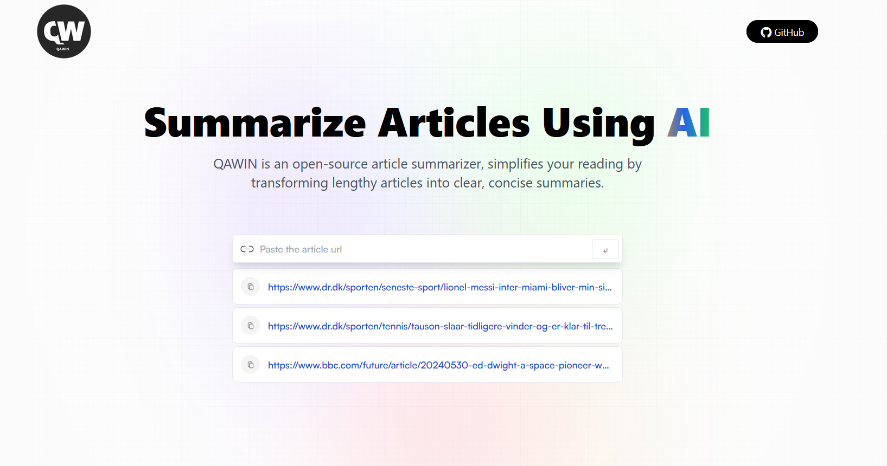

# AI Article Summarizer App 

## 📋 <a name="table">Table of Contents</a>

1. [Introduction](#introduction)
2. [Tech Stack](#tech-stack)
3. [Features](#features)
4. [Quick Start](#quick-start)

## <a name="introduction">Introduction</a>

This application enables you to summarize articles with just one click using the OpenAI model.

## 🌐 <a href="https://ai-article-summarizer-app-qawin.vercel.app/" target="blank" align="center"> Live Preview </a>

<a href="https://ai-article-summarizer-app-qawin.vercel.app/" target="blank" align="center">
  <picture>
    <source media="(prefers-color-scheme: dark)" srcset="readme.png">
    
  </picture>
</a>

## <a name="tech-stack">Tech Stack</a>

- React.js
- Redux Toolkit
- Tailwind CSS
- Rapid API

## <a name="features">Features</a>

👉 **Modern User Interface**: The software features a modern, user-friendly interface that provides an intuitive experience for users.

👉 **Summary Generation**: The web app allows users to input the URL of a lengthy article, then employs AI technology to generate a concise summary of the article's key content.

👉 **History Saving with Local Storage**: The app's history feature enables users to conveniently save and revisit summaries of their reading activity on their local device.

👉 **Copy to Clipboard Functionality**: The tool allows users to quickly share or save the summarized content by copying it to their clipboard.

👉 **Advanced RTK Query API Requests**: The application leverages the powerful features of Redux Toolkit (RTK) Query to efficiently manage API requests. These requests are triggered conditionally based on predefined criteria, optimizing the data fetching and management processes.

## <a name="quick-start"> Quick Start</a>

To set up the project on your local machine, follow these steps.

**Prerequisites**

Ensure that the following components are installed on your computer:

- [Git](https://git-scm.com/)
- [Node.js](https://nodejs.org/en)
- [npm](https://www.npmjs.com/) (Node Package Manager)

**Cloning the Repository**

```bash
git clone https://github.com/jkalbasri/backend--ai-article-summarizer-app-qa
cd backend--ai-article-summarizer-app-qa
```

**Installation**

Install the project dependencies using npm:

```bash
npm install
```

**Set Up Environment Variables**

Create a new file named `.env` in the root of your project and add the following content:

```env
VITE_RAPID_API_ARTICLE_KEY=
```

To access the service, replace the placeholder values with your unique API key and secret, which you can obtain by signing up on the platform. [Rapid API website](https://rapidapi.com/restyler/api/article-extractor-and-summarizer).

**Running the Project**

```bash
npm run dev
```

Open [http://localhost:5173](http://localhost:5173) in your browser to view the project.
